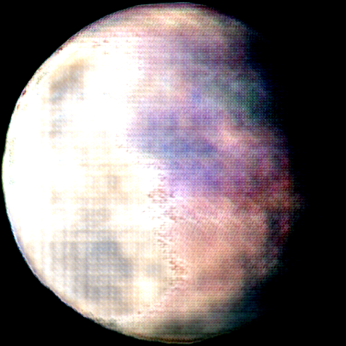
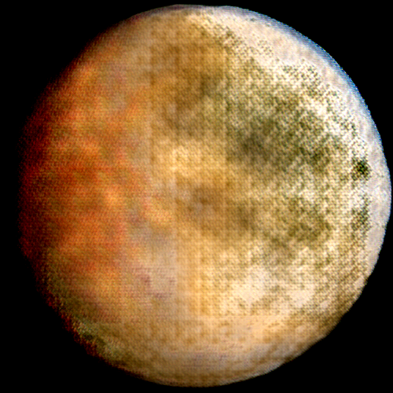
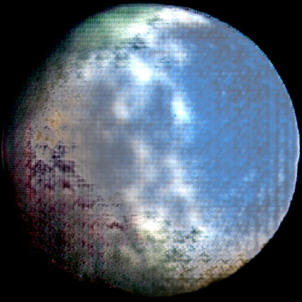
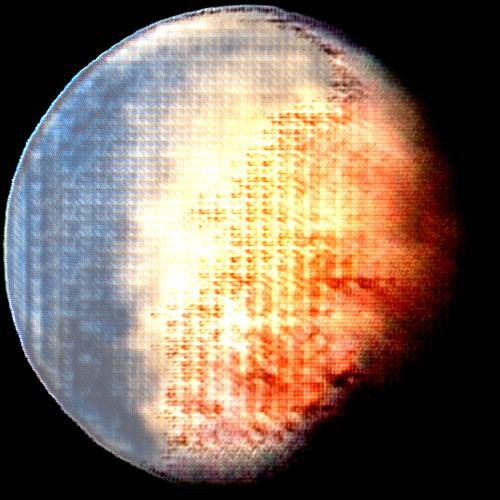
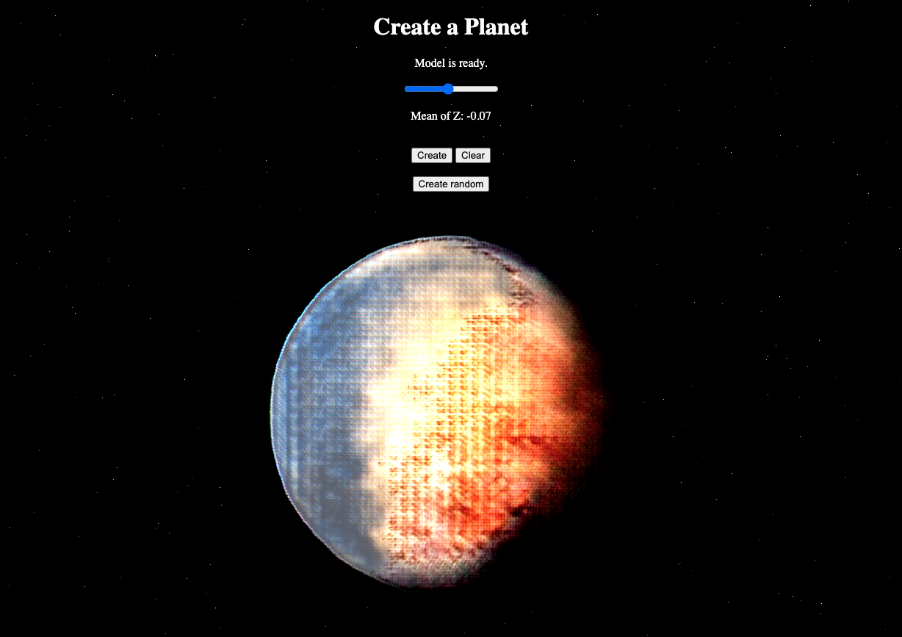

# Ganiverse

  
  
  
  

This is the respository for our project: [Generating realistic fantasy planets with Generative Adversarial Networks](report/ganiverse.pdf). 

## Project overview

We take a collection of 31 celestial objects including 13 planets and 18 moons and send it through a mix-up and basic data augmention pipeline to stretch the dataset. The Mix-up data augmentation is inspired by FAIR's preprocessing for their ConvNeXt. We end up with a total of 5,000 images to train our network. 

Using a loss function comprising of the WGAN loss and the Structural Similarity Index (SSIM), our model managed to build on top of previous works of GAN training in the context of astronomy. It is able to generate realistic celestial objects with proper textures, sources of light and coloring.

## Links

Our results can be accessed at [theseplanetsdonotexist.com](https://theseplanetsdonotexist.com), where one can generate new planets interactively. This project will be hosted on the parent website [space.ml](https://space.ml), a collection of machine learning projects about the universe.

    

## File structure

- `/code` : All important files. `gan_w.py` is the main file. `pipeline.sh` executes data augmentation and trains the model.
- `/code/lazylossbot` : An integration of the Telegram API to monitor the training in real-time.
- `/data` : Data files.
- `/data/media` : Images for the README.
- `/data/raw` : Raw scraped images of planets.
- `/data/saved_model` : The saved model weights of the trained generator. This file will be overwritten every time the model is trained.
- `/postprocessing` : Post-processing and bulk inference generating testing scripts.
- `/postprocessing/2D` : Scripts and temp folders for post-processing 2D images using the bilateralFilter from OpenCV. 
- `/postprocessing/3D` : Scripts for generating 3D planets (spheres) from images using the PyVista package. 
- `/report` : Project paper and slides.

## Credits

This project was developed by Maximilian Kalcher ([max.com.ai](https://max.com.ai)) and Christian Burmester. 